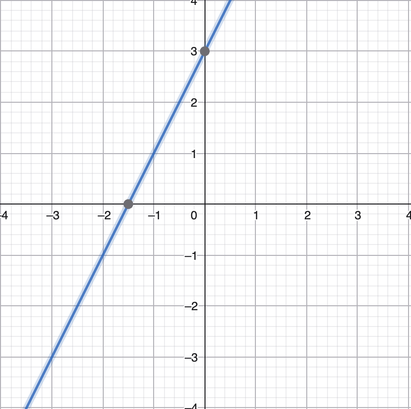

# Resolución de Ejercicios Complementarios - Semana 1

## Matemáticas y Álgebra Básica

### Ejercicio 1: Operaciones Algebraicas Básicas

**a) `3x + 5 = 17`**

1. `3x = 17 - 5`
2. `3x = 12`
3. `x = 12/3`
**Resultado:**  `x = 4`

**b) `2y - 8 = 22`**

1. `2y = 22 + 8`
2. `2y = 30`
3. `y = 30/2`
**Resultado:** `y = 15`

**c)  `4z + 3 = 3z + 10`**

1. `4z - 3z + 3 = 10`
2. `z + 3 = 10`
3. `z = 10 - 3`
**Resultado:**  `z = 7`

**d) `5(x + 2) = 35`**

1. `x + 2 = 35/5`
2. `x + 2 = 7`
3. `x = 7 - 2`
**Resultado:** `x = 5`

---

### Ejercicio 2: Funciones Lineales

Dada la función `f(x) = 2x + 3`:

**Cálculos de puntos:**

- `f(0) = 2(0) + 3 = 3`
- `f(1) = 2(1) + 3 = 5`
- `f(5) = 2(5) + 3 = 13`
- `f(10) = 2(10) + 3 = 23`



**Identificación de elementos:**

- **Pendiente (`m`):** 2 (Indica que por cada unidad que aumenta `x`, `f(x)` aumenta `2`).
- **Ordenada al origen (`b`):** 3 (Es el punto donde la recta corta el eje Y, es decir, `f(0)`).

---

### Ejercicio 3: Escalas y Volúmenes (Big Data)

| Cantidad | Notación Científica | Prefijo |
| :--- | :--- | :--- |
| 1,000,000 bytes | 10^6  bytes | Megabyte (MB) |
| 1,000,000,000 registros | 10^9  registros | Gigaregistros |
| 1,000,000,000,000 bytes | 10^12  bytes | Terabyte (TB) |

---

## II. Lógica Computacional

### Ejercicio 4: Algoritmos (Lógica)

**1. Determinar si un número es par o impar:**

1. Inicio.
2. Leer número `N`.
3. Calcular `R = N % 2`.
4. Si `R == 0` entonces: Mostrar "Es Par".
5. De lo contrario: Mostrar "Es Impar".
6. Fin.

**2. Calcular el promedio de 3 números:**

1. Inicio.
2. Leer `n1, n2, n3`.
3. Sumar `S = n1 + n2 + n3`.
4. Dividir `P = S/3`.
5. Mostrar `P`.
6. Fin.

---

### Ejercicio 5: Pseudocódigo

**1. Calcular el factorial de un número:**

```text
Algoritmo CalcularFactorial
    Escribir "Ingrese un número:"
    Leer n
    factorial <- 1
    Para i <- 1 Hasta n Con Paso 1 Hacer
        factorial <- factorial * i
    FinPara
    Escribir "El factorial es: ", factorial
FinAlgoritmo
```

**2. Ordenar una lista (Burbuja simple):**

```text
Algoritmo OrdenarLista
    // Suponiendo una lista L de tamaño N
    Para i <- 1 Hasta N-1 Hacer
        Para j <- 1 Hasta N-i Hacer
            Si L[j] > L[j+1] Entonces
                temp <- L[j]
                L[j] <- L[j+1]
                L[j+1] <- temp
            FinSi
        FinPara
    FinPara
FinAlgoritmo
```

---

### Ejercicio 6: Operaciones Booleanas

Dadas las variables: `a = True`, `b = False`, `c = True`.

- `print(a and b)` → **False** (True AND False es False)
- `print(a or b)` → **True** (True OR False es True)
- `print(not b)` → **True** (NOT False es True)
- `print(a and c)` → **True** (True AND True es True)
- `print((a or b) and c)` → **True** ( (True) AND True es True)

---

## III. Investigación

### Ejercicio 7: Historia de la Ciencia de Datos

1. **¿Quién es considerada la primera científica de datos?**

Se considera a Florence Nightingale (1820–1910) como la primera científica de datos de la historia, mucho antes de que el término existiera oficialmente.

Durante la Guerra de Crimea, Nightingale no solo se dedicó a la enfermería, sino que recopiló y analizó meticulosamente da

- Análisis Estadístico: Descubrió, mediante el registro de datos, que la mayoría de los soldados no morían por heridas de combate, sino por enfermedades prevenibles causadas por las pésimas condiciones sanitarias de los hospitales.

- Visualización de Datos: Inventó el Diagrama de Área Polar (conocido como Coxcomb), una forma innovadora de presentar estadísticas complejas de manera visual y comprensible.

- Impacto Real: Utilizó estos datos y sus gráficos para convencer al gobierno británico de implementar reformas sanitarias urgentes, lo que redujo drásticamente la tasa de mortalidad y sentó las bases de la epidemiología y la estadística moderna aplicada a la salud pública.

1. **¿Qué es el "Data Science Venn Diagram" de Drew Conway?**

Drew Conway define la Ciencia de Datos como la intersección de tres áreas fundamentales. Las uniones entre estas áreas determinan el tipo de perfil o resultado obtenido:

Las 3 Áreas Principales:

- Hacking Skills (Habilidades de Programación): No se refiere a ciberseguridad, sino a la capacidad de manipular archivos de texto, usar la línea de comandos y programar algoritmos para extraer y limpiar datos.

- Math & Statistics Knowledge (Matemáticas y Estadística): La capacidad de elegir los métodos estadísticos adecuados y entender los modelos teóricos que sustentan el análisis de los datos.

- Substantive Expertise (Conocimiento del Dominio): El conocimiento profundo sobre el área donde se aplican los datos (negocios, biología, finanzas, etc.) para saber qué preguntas hacer y cómo interpretar los resultados.

Las Uniones e Implicaciones:

- Hacking Skills + Math & Stats = Machine Learning: Es la capacidad de crear modelos predictivos potentes, pero sin el contexto del negocio, el modelo podría estar resolviendo el problema equivocado.

- Math & Stats + Substantive Expertise = Traditional Research: Es la investigación académica clásica. Se analizan datos con rigor estadístico sobre un tema conocido, pero sin las habilidades computacionales para manejar grandes volúmenes de datos (Big Data).

- Hacking Skills + Substantive Expertise = Danger Zone (Zona de Peligro): Es la combinación más riesgosa. Alguien que sabe programar y conoce el negocio, pero no entiende la estadística detrás de los datos, puede crear visualizaciones o modelos que parecen correctos pero que conducen a conclusiones falsas o correlaciones espurias.

- La Intersección de las Tres = Data Science: El punto ideal donde se tiene la técnica (código), el rigor (matemáticas) y el propósito (conocimiento del área).

1. **Menciona 3 herramientas modernas de Big Data:**
    - GCP BigQuery: Es un almacén de datos (Data Warehouse) de Google Cloud, totalmente gestionado y sin servidor, que permite realizar consultas SQL extremadamente rápidas sobre conjuntos de datos de escala petabyte.

    - AWS Redshift: Un servicio de Data Warehouse a escala de petabytes en la nube de Amazon Web Services. Utiliza almacenamiento en columnas y ejecución de consultas paralelas para analizar datos de manera eficiente.

    - Apache Spark: Un motor de procesamiento de datos multienlace y de código abierto. Es conocido por su velocidad al procesar datos en memoria y es fundamental para tareas de ingeniería de datos, ciencia de datos y aprendizaje automático a gran escala.

---

### Ejercicio 8: Aplicaciones de Big Data

- **Salud:** Predicción de brotes epidémicos analizando datos de búsquedas en Google y registros hospitalarios en tiempo real.
- **Finanzas:** Sistemas de detección de fraudes que analizan millones de transacciones por segundo para identificar patrones inusuales.
- **Redes Sociales:** Algoritmos de recomendación (como los de TikTok o Instagram) que procesan el comportamiento del usuario para personalizar el contenido.
- **Deportes:** El uso de *Moneyball* o analítica avanzada en la NBA para determinar las posiciones de tiro con mayor probabilidad de éxito basándose en el histórico de los jugadores.
