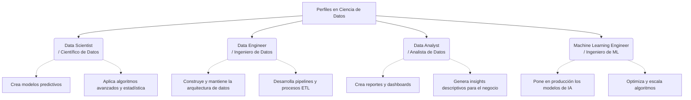

# Reporte: Conceptos Fundamentales de la Ciencia de Datos

## Definición y Componentes de la Ciencia de Datos

**¿Qué es la ciencia de datos?**
La ciencia de datos (Data Science) es un campo multidisciplinario que utiliza métodos científicos, procesos, algoritmos y sistemas para extraer conocimientos, patrones y valor tanto de datos estructurados como no estructurados. Su objetivo principal es ayudar en la toma de decisiones basada en la evidencia empírica.

**Componentes principales:**
Para que la ciencia de datos sea efectiva, convergen tres áreas de conocimiento clave:

* **Ciencias de la Computación / Programación:** Habilidad para procesar datos, programar algoritmos y utilizar bases de datos (Python, R, SQL, etc.).
* **Matemáticas y Estadística:** Fundamento para crear modelos predictivos, comprender distribuciones de probabilidad y validar hipótesis.
* **Conocimiento del Dominio (Negocio):** Comprensión profunda de la industria específica en la que se aplican los datos para que los hallazgos tengan un impacto real y resuelvan problemas concretos.

---

## Datos Estructurados vs. No Estructurados

La principal diferencia radica en cómo se organizan y almacenan los datos:

* **Datos Estructurados:** Tienen un formato predefinido y organizado, generalmente en forma tabular (filas y columnas). Son fáciles de buscar, organizar y analizar utilizando lenguajes como SQL.
  * *Ejemplos:* Hojas de cálculo de Excel, bases de datos relacionales, tablas de inventario.
* **Datos No Estructurados:** Carecen de un formato predefinido o modelo de datos estructurado. Su naturaleza es desorganizada, lo que los hace más difíciles de recopilar, procesar y analizar sin el uso de herramientas avanzadas de Inteligencia Artificial.
  * *Ejemplos:* Archivos de texto libre, correos electrónicos, imágenes, videos, publicaciones en redes sociales y archivos de audio.

---

## Las 5 "V" del Big Data

El Big Data se caracteriza por cinco dimensiones fundamentales, conocidas como las 5 V:

1. **Volumen:** Se refiere a la inmensa cantidad de datos generados cada segundo.
    * *Ejemplo:* Las miles de millones de horas de video que están almacenadas en los servidores de YouTube.
2. **Velocidad:** La rapidez con la que se generan, procesan y analizan los datos.
    * *Ejemplo:* El procesamiento en tiempo real de transacciones con tarjetas de crédito para detectar y bloquear fraudes instantáneamente.
3. **Variedad:** La diversidad en los tipos y formatos de datos (estructurados, semi-estructurados y no estructurados).
    * *Ejemplo:* Un sistema médico que analiza historiales clínicos (texto), radiografías (imágenes) y lecturas de monitores cardíacos (series de tiempo).
4. **Veracidad:** La calidad, precisión y confiabilidad de los datos.
    * *Ejemplo:* La limpieza de una base de datos de encuestas para eliminar respuestas de "bots" o datos incompletos antes de realizar un análisis.
5. **Valor:** La capacidad de transformar los datos crudos en información útil y rentable para el negocio.
    * *Ejemplo:* Utilizar el historial de compras de los clientes para crear un sistema de recomendación que aumente las ventas de un e-commerce en un 15%.

---

## Perfiles Profesionales en Ciencia de Datos

A continuación, se presenta un mapa conceptual con los roles más destacados dentro del ecosistema de la ciencia de datos:

