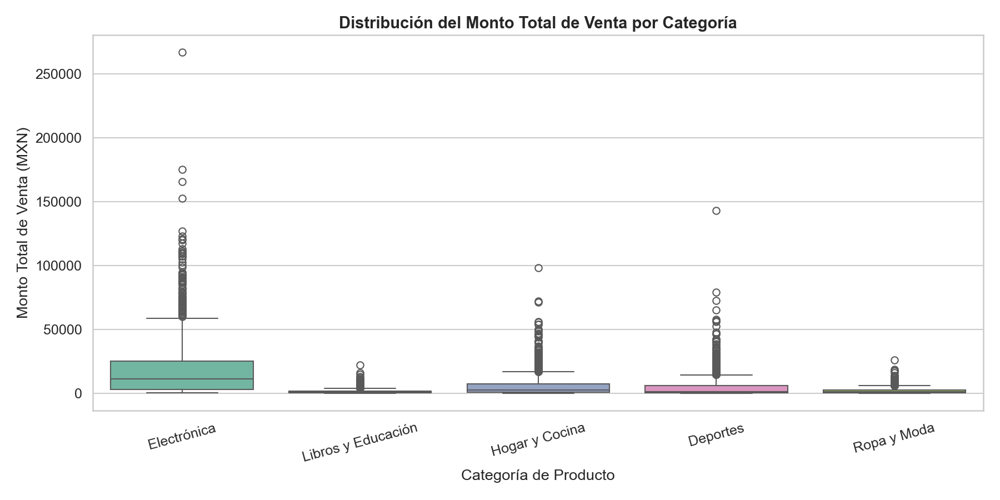
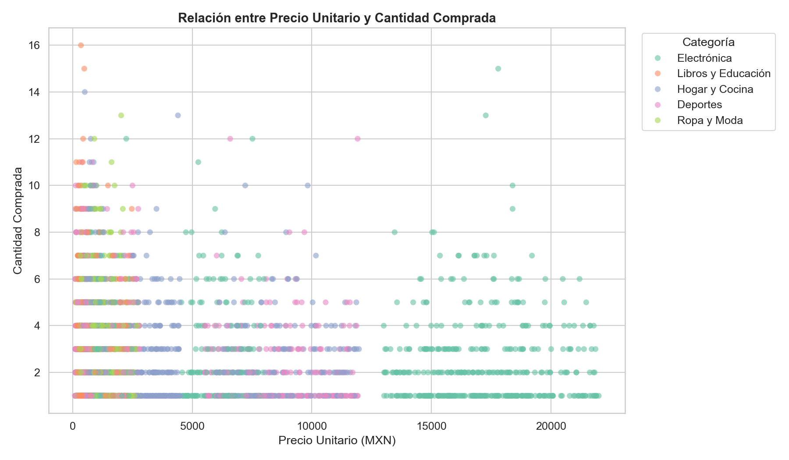
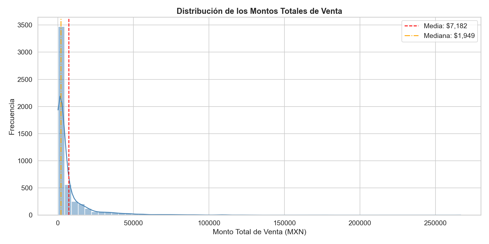

```markdown
# Reporte de Análisis Exploratorio de Datos

## Todo ventas en Línea, S.A. de C.V.

---

## 1. Definición del Problema

### Objetivo

Analizar los datos históricos de ventas (5,000 transacciones) para
identificar patrones de consumo, productos más rentables, segmentos de
clientes clave y estacionalidad, a fin de fundamentar las estrategias
comerciales del presente año.

### Preguntas de Investigación

1. ¿Cuáles son las categorías y productos con mayor ingreso y volumen?
2. ¿Qué perfiles de cliente (edad, género) generan más valor?
3. ¿En qué meses se concentran las ventas más altas?
4. ¿Cómo se relacionan precio unitario, cantidad y descuento con el monto
   total?
5. ¿Existen valores atípicos que requieran atención especial?

---

## 2. Descripción del Dataset

- **Registros:** 5,000
- **Columnas:** 12 originales + 3 derivadas (`total_sale`, `month`, `year`)

| Tipo | Columnas |
| ---- | ---- |
| Numérico (int) | `age`, `quantity` |
| Numérico (dec) | `unit_price`, `discount` |
| Categórico | `gender`, `category`, `product_name` |
| Estructurado | `order_id`, `date` |
| No estructurado | `customer_name`, `customer_email`, `review_comment` |

---

## 3. Calidad de los Datos

| Indicador | Resultado |
| ---- | ---- |
| Valores nulos totales | Solo en `review_comment`: 1,449 (28.98%) |
| Registros duplicados | 0 |
| Reseñas vacías (string) | 0 (los faltantes son `NaN`, no strings vacíos) |

**Observaciones:**

- El dataset está limpio en cuanto a las 11 columnas principales; no hay
  valores faltantes en variables numéricas ni categóricas.
- La columna `review_comment` tiene ~29% de valores nulos, lo cual es
  coherente con el comportamiento real de e-commerce donde no todos los
  clientes dejan reseña. Esto no afecta el análisis numérico.
- No existen registros duplicados gracias a la clave única `order_id`.

---

## 4. Interpretación de Estadísticas Descriptivas

### 4.1 Variables Numéricas

| Variable | Media | Mediana | Moda |
| ---- | ---- | ---- | ---- |
| `age` | 35.10 años | 35.00 años | 18.00 años |
| `unit_price` | $3,161.53 | $1,006.76 | $102.71 |
| `quantity` | 2.48 uds | 2.00 uds | 1.00 ud |
| `discount` | 0.07 (7%) | 0.00 | 0.00 |
| `total_sale` | $7,181.99 | $1,949.16 | $1,117.98 |

**Análisis:**

- **Edad:** La distribución es aproximadamente normal centrada en 35 años.
  Sin embargo, la moda es 18, lo que indica una concentración notable de
  clientes jóvenes en el límite inferior del rango. Esto sugiere un
  segmento de compradores jóvenes activo que merece atención.

- **Precio unitario:** Existe una diferencia muy marcada entre la media
  ($3,161) y la mediana ($1,006). Esto indica una **distribución fuertemente
  sesgada a la derecha**: la mayoría de los productos vendidos son de precio
  bajo-medio, pero los productos de Electrónica (smartphones, laptops hasta
  $22,000) elevan considerablemente la media. La moda de $102.71
  corresponde a productos de bajo costo como la cuerda para saltar o
  playeras básicas.

- **Cantidad:** La distribución es exponencial; la mayoría de las compras
  son de 1-2 unidades (moda = 1, mediana = 2). La media de 2.48 está
  ligeramente por encima de la mediana, confirmando una cola derecha con
  compras ocasionales de mayor volumen.

- **Descuento:** El 60% de las transacciones no tienen descuento (moda y
  mediana = 0). La media de 7% refleja que cuando se aplica descuento,
  este oscila entre 5% y 30%.

- **Total de venta:** La diferencia entre media ($7,181) y mediana ($1,949)
  es la más pronunciada de todas las variables. Esto confirma que unas
  pocas transacciones de alto valor (productos electrónicos con cantidades
  mayores) inflan significativamente el promedio. **La mediana es un
  indicador más representativo del comportamiento típico de compra.**

### 4.2 Variables Categóricas

**Género:**

| Género | Frecuencia | Porcentaje |
| ---- | ---- | ---- |
| Femenino | 2,282 | 45.6% |
| Masculino | 2,197 | 43.9% |
| No binario | 521 | 10.4% |

La distribución de género es relativamente equilibrada entre Femenino y
Masculino, con un 10% de clientes identificados como No binario. No se
observa una dominancia marcada de un solo género.

**Categoría de producto:**

| Categoría | Órdenes | Ingreso Total | Venta Promedio |
| ---- | ---- | ---- | ---- |
| Electrónica | 980 | $19,767,908.93 | $20,171.34 |
| Hogar y Cocina | 1,023 | $6,671,813.00 | $6,521.81 |
| Deportes | 993 | $5,456,133.16 | $5,494.60 |
| Ropa y Moda | 1,046 | $2,418,096.31 | $2,311.76 |
| Libros y Educación | 958 | $1,595,975.69 | $1,665.95 |

**Hallazgo clave:** Aunque **Electrónica** tiene el menor número de
órdenes (980), genera **más del 55% del ingreso total** con una venta
promedio de $20,171 — más de 3 veces la segunda categoría. En contraste,
**Ropa y Moda** lidera en volumen de órdenes (1,046) pero solo aporta
el 6.7% del ingreso.

**Producto más vendido:** Playera algodón básica (222 órdenes), seguido
de Balón de fútbol Adidas (221) y Sartén antiadherente T-Fal (220). Los
productos de bajo precio dominan en frecuencia.

### 4.3 Tendencia Mensual

| Mes | Venta Promedio |
| ---- | ---- |
| Septiembre | $8,878.34 |
| Noviembre | $8,092.50 |
| Mayo | $7,811.24 |
| Diciembre | $7,664.52 |
| Julio | $7,235.04 |
| Junio | $7,427.60 |
| Agosto | $7,043.00 |
| Marzo | $6,565.27 |
| Febrero | $6,458.33 |
| Abril | $6,429.82 |
| Enero | $6,357.78 |
| Octubre | $6,251.65 |

**Análisis:** Los meses con mayor venta promedio son **septiembre**
($8,878) y **noviembre** ($8,092), posiblemente asociados con el regreso
a clases y las campañas de fin de año (Buen Fin, Black Friday). **Mayo**
también destaca, coincidiendo con el Día de las Madres. Los meses de
**enero y octubre** son los de menor venta promedio, lo que sugiere que
son períodos de baja demanda tras las temporadas fuertes.

---

## 5. Detección de Valores Atípicos (Método IQR)

| Variable | Outliers | Límite Inferior | Límite Superior |
| ---- | ---- | ---- | ---- |
| `unit_price` | 933 | -$2,491.04 | $5,576.19 |
| `total_sale` | 674 | -$7,310.87 | $14,368.34 |
| `quantity` | 227 | -2.00 | 6.00 |

**Interpretación:**

- **Precio unitario:** 933 registros (18.7%) superan el umbral de
  $5,576. Estos corresponden a productos de Electrónica (laptops,
  smartphones, tablets) y Hogar (aspiradoras robot, cafeteras premium).
  No son errores sino productos legítimamente de alto precio.

- **Total de venta:** 674 registros (13.5%) con montos superiores a
  $14,368. Son combinaciones de productos caros con cantidades mayores
  a 1 y sin descuento. El valor máximo alcanza ~$264,000 (visible en el
  boxplot de Electrónica).

- **Cantidad:** 227 registros (4.5%) con más de 6 unidades. Aunque la
  distribución exponencial hace que compras de 7+ unidades sean
  estadísticamente atípicas, son plausibles en un contexto de e-commerce.

**Recomendación:** No se deben eliminar estos outliers ya que representan
transacciones legítimas. Sin embargo, para modelado predictivo futuro se
recomienda aplicar transformaciones logarítmicas o analizar estos
segmentos por separado.

---

## 6. Interpretación de Visualizaciones

### 6.1 Diagrama de Cajas (Box Plot)



**Observaciones detalladas:**

- **Electrónica** domina la gráfica con la mayor dispersión: su caja se
  extiende aproximadamente de $3,000 a $25,000, con la mediana alrededor
  de $13,000. Presenta numerosos outliers que alcanzan hasta **$264,000**,
  representando compras de múltiples unidades de laptops o smartphones.

- **Hogar y Cocina** tiene la segunda mayor dispersión con outliers hasta
  ~$100,000. La caja es más compacta que Electrónica, con mediana
  alrededor de $3,000. Los outliers corresponden a compras de aspiradoras
  robot y cafeteras de alta gama en cantidad.

- **Deportes** muestra un comportamiento interesante: caja compacta con
  mediana baja (~$3,000) pero outliers que llegan hasta ~$140,000. Esto
  se explica por productos como la bicicleta de montaña ($5,500-$12,000)
  comprada en múltiples unidades.

- **Ropa y Moda** y **Libros y Educación** presentan las cajas más
  compactas y pegadas al eje, con medianas por debajo de $2,000. Sus
  outliers son los menos extremos (hasta ~$25,000 y ~$20,000
  respectivamente).

**Decisión comercial:** Electrónica es el motor de ingresos pero con alta
variabilidad. Se recomienda crear estrategias diferenciadas: para productos
de alto ticket (>$10,000), enfocarse en financiamiento y garantías; para
productos de bajo ticket, impulsar volumen con bundles y envío gratis.

### 6.2 Gráfica de Dispersión (Scatter Plot)



**Observaciones detalladas:**

- Se confirma una **relación inversa débil** entre precio y cantidad: a
  medida que el precio unitario aumenta, la concentración de puntos se
  desplaza hacia cantidades bajas (1-3 unidades).

- **Electrónica** (verde) se extiende por todo el eje X hasta $22,000,
  con puntos dispersos en cantidades de 1-4 para precios altos y hasta
  13-15 para precios más bajos (audífonos, smartwatch).

- **Libros y Educación** (naranja) y **Ropa y Moda** (verde oliva) se
  concentran en el extremo izquierdo (precios < $2,500), pero presentan
  la mayor variabilidad en cantidad, con compras de hasta 12-16 unidades.

- **Hogar y Cocina** (morado) muestra dos clusters visibles: uno de
  productos económicos (sartenes, sábanas < $1,500) con cantidades
  variadas, y otro de productos premium (aspiradoras > $6,000) con
  cantidades bajas.

- Los puntos más extremos (precio alto + cantidad alta) son escasos pero
  representan las transacciones outlier identificadas anteriormente.

- La relación **no es lineal** — no existe una correlación fuerte, lo
  que indica que la decisión de cantidad de compra depende de factores
  como necesidad, tipo de producto y promociones, no solo del precio.

**Decisión comercial:** Para productos con precio < $3,000, implementar
estrategias de "compra más, ahorra más" (descuentos por volumen). Para
productos > $10,000, enfocarse en conversión unitaria con valor agregado
(garantía extendida, accesorios incluidos).

### 6.3 Histograma



**Observaciones detalladas:**

- La distribución está **extremadamente sesgada a la derecha**. La gran
  mayoría de las transacciones (>3,500) se concentran en el rango de
  $0 a $5,000.

- La **media ($7,182)** se encuentra muy a la derecha de la **mediana
  ($1,949)**, una diferencia de más de $5,000 que confirma el fuerte
  sesgo provocado por las transacciones de alto valor en Electrónica.

- La curva KDE muestra un pico muy pronunciado cerca de $0-$2,000 que
  cae abruptamente. A partir de $25,000, las transacciones son muy
  escasas pero se extienden hasta ~$264,000.

- Existe un pequeño repunte visible alrededor de $10,000-$20,000 que
  corresponde a las transacciones unitarias de productos electrónicos
  de precio medio-alto.

- La cola derecha es extremadamente larga en proporción a la masa
  principal, indicando que menos del 15% de las transacciones generan
  la mayoría del ingreso.

**Decisión comercial:**

- **Ticket promedio real (mediana):** $1,949. Establecer el umbral de
  envío gratis en $2,000 incentivaría a la mitad de los clientes a
  aumentar ligeramente su compra.
- **Segmentación de clientes:** Crear un programa de lealtad para
  clientes con compras recurrentes > $5,000 (percentil 75), que
  representan el segmento de mayor valor.
- La media no es un buen indicador para metas de venta diarias; usar
  la mediana como referencia más realista.

---

## 7. Conclusiones y Recomendaciones Estratégicas

### Producto y Categoría

1. **Electrónica es el pilar de ingresos:** Con solo el 19.6% de las
   órdenes genera el 55% del ingreso total. Se recomienda ampliar el
   catálogo, asegurar stock y negociar mejores márgenes con proveedores.

2. **Ropa y Moda lidera en volumen:** Es la categoría con más órdenes
   (1,046) pero bajo ticket promedio ($2,311). Ideal para estrategias
   de cross-selling y bundles.

3. **Libros y Educación necesita impulso:** Menor ingreso total y por
   transacción. Ofrecer descuentos focalizados y paquetes temáticos.

### Segmento de Mercado

4. **Perfil principal:** Clientes de 25-45 años, distribución de género
   equilibrada. Las campañas de marketing digital deben segmentarse por
   categoría de interés más que por género.

5. **Segmento joven (18-25):** La moda de edad en 18 años indica un
   nicho activo de compradores jóvenes. Considerar colaboraciones con
   influencers y promociones en redes sociales.

### Temporalidad

6. **Meses fuertes:** Septiembre, noviembre y mayo. Reforzar inventario,
   campañas de marketing y logística en estos períodos.

7. **Meses débiles:** Enero y octubre. Implementar promociones
   especiales, liquidaciones de temporada o eventos de lealtad para
   mantener el flujo de ventas.

### Estrategia de Precios y Descuentos

8. **Descuentos selectivos:** El 60% de las ventas se realizan sin
   descuento. Mantener esta política pero activar descuentos
   estratégicos en categorías de menor rotación y en meses débiles.

9. **Envío gratis a partir de $2,000:** Basado en la mediana de
   `total_sale`, este umbral incentivará un aumento en el ticket
   promedio sin sacrificar margen excesivamente.

